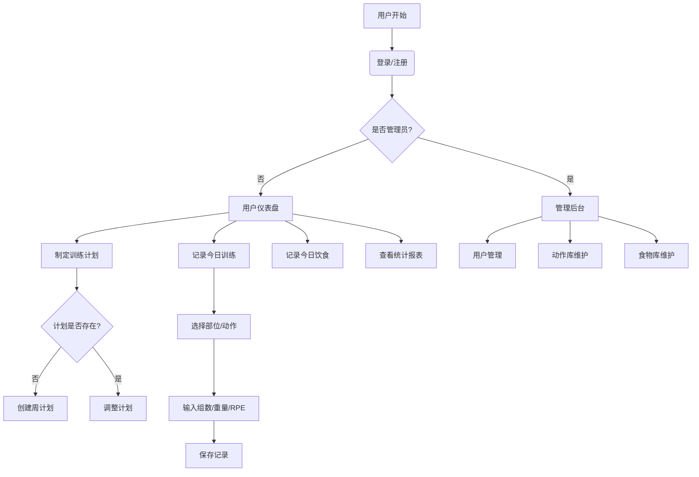
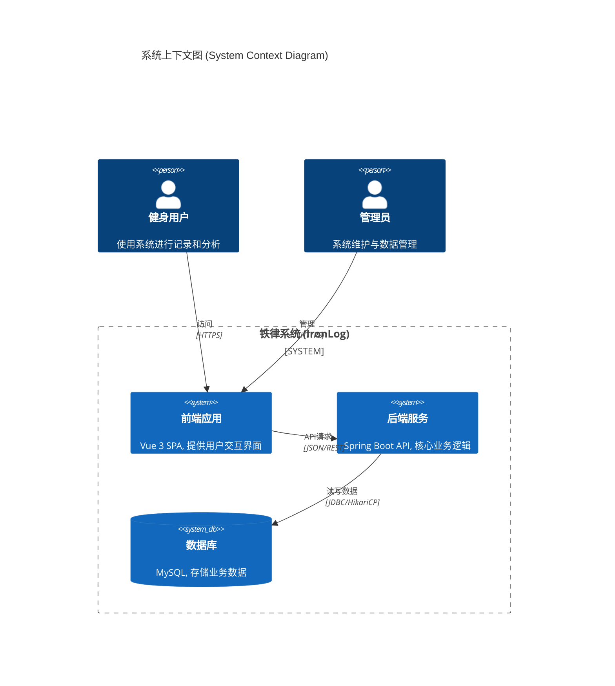
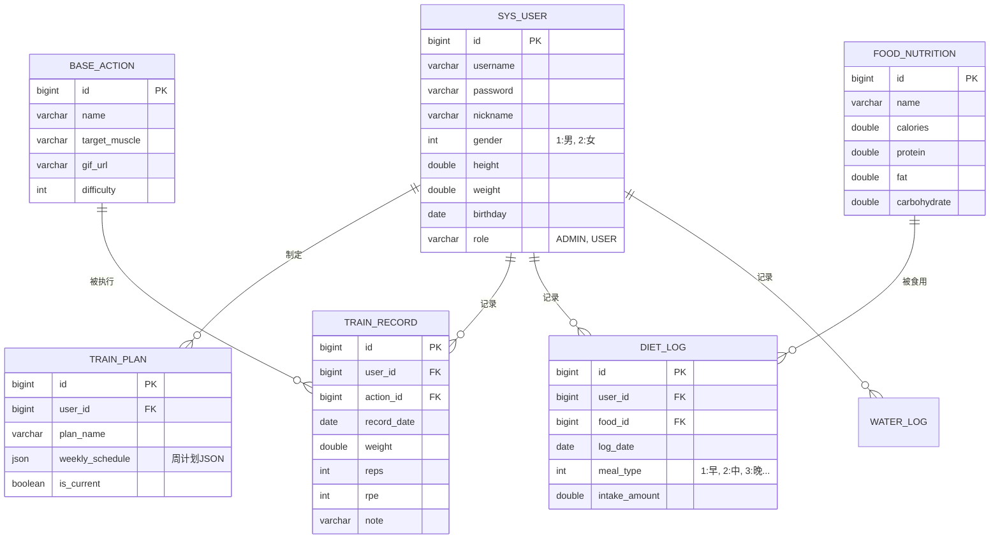
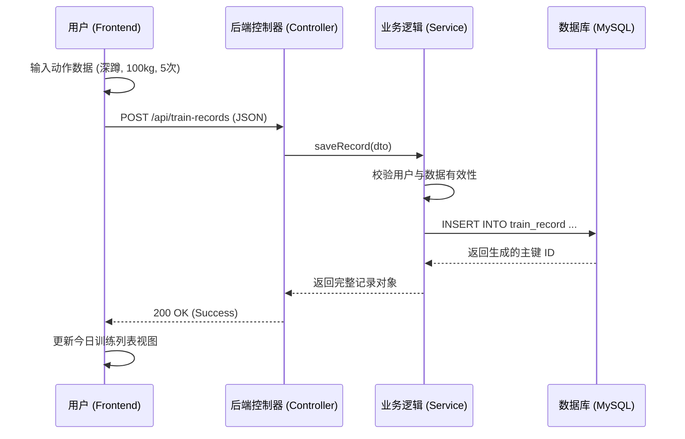

# 铁律项目 (IronLog) 全套项目文档

**文档版本**: v1.0
**作者**: 资深系统架构师
**最后更新**: 2024-05-27

---

## 目录 (Table of Contents)

1.  [项目概述](#1-项目概述)
2.  [需求规格说明书 (PRD)](#2-需求规格说明书-prd)
    *   2.1 [用户角色与流程](#21-用户角色与流程)
    *   2.2 [功能需求](#22-功能需求)
    *   2.3 [非功能需求](#23-非功能需求)
3.  [系统设计文档 (SDD)](#3-系统设计文档-sdd)
    *   3.1 [系统架构设计](#31-系统架构设计)
    *   3.2 [技术选型](#32-技术选型)
    *   3.3 [数据库设计](#33-数据库设计)
    *   3.4 [接口设计规范](#34-接口设计规范)
4.  [用户操作手册](#4-用户操作手册)
    *   4.1 [系统登录](#41-系统登录)
    *   4.2 [仪表盘 (Dashboard)](#42-仪表盘-dashboard)
    *   4.3 [训练日记](#43-训练日记)
    *   4.4 [饮食追踪](#44-饮食追踪)
    *   4.5 [日程管理](#45-日程管理)

---

## 1. 项目概述

**铁律 (IronLog)** 是一款专为运动爱好者设计的综合性健康管理平台。项目旨在通过数据化的方式帮助用户记录训练、饮食和身体指标，提供可视化的进度追踪，并构建社区激励机制。系统集成了训练计划管理、动作库查询、热量计算、日程打卡等核心功能。

---

## 2. 需求规格说明书 (PRD)

### 2.1 用户角色与流程

系统主要面向普通用户 (User) 和管理员 (Admin)。

*   **普通用户**: 制定计划、记录训练、记录饮食、查看报表、社区互动。
*   **管理员**: 用户管理、基础数据维护 (动作库、食物库)、系统公告。

#### 核心业务流程 (Mermaid Flowchart)

### 2.2 功能需求

| 模块 | 功能点 | 详细描述 |
| :--- | :--- | :--- |
| **仪表盘** | 状态概览 | 展示今日训练状态、待办事项、最近体重变化曲线。 |
| | 快捷入口 | 快速跳转至“开始训练”、“记录饮食”、“饮水打卡”。 |
| | 饮水模块 | 记录每日饮水量，展示今日目标达成率。 |
| **训练日记** | 动作库 | 提供涵盖胸、背、腿等部位的基础动作查询 (含GIF演示)。 |
| | 训练记录 | 记录具体动作的组数、重量 (kg)、次数 (reps)、RPE (自觉疲劳度)。 |
| | 历史对比 | 在记录时自动展示该动作的历史最佳成绩和上次记录。 |
| **饮食追踪** | 食物查询 | 支持搜索常见食物，查看热量、蛋白质、碳水、脂肪含量。 |
| | 饮食记录 | 按早/中/晚/加餐记录食物摄入，自动计算总热量及宏量营养素。 |
| **我的日程** | 训练日历 | 月视图展示训练历史，**绿色打钩**表示已完成，**红色叉号**表示未完成/休息。 |
| | 计划管理 | 设定每周训练安排 (如: 周一练胸，周二练背)。 |
| **社区排行** | 榜单 | 展示用户训练容量排行、活跃度排行。 |
| **个人设置** | 基础信息 | 修改头像、昵称、身高、体重、生日等信息。 |

### 2.3 非功能需求

*   **性能**: API响应时间 < 200ms (95% percentile)。
*   **兼容性**: 前端适配主流浏览器 (Chrome, Edge, Safari)。
*   **安全性**: 密码加密存储 (BCrypt)，API 鉴权。
*   **部署**: 支持 Docker 容器化部署。

---

## 3. 系统设计文档 (SDD)

### 3.1 系统架构设计

系统采用典型的前后端分离架构。

*   **前端**: Vue 3 + Element Plus + Vite + ECharts。
*   **后端**: Spring Boot (Java 21) + Spring Data JPA。
*   **数据库**: MySQL 8.0。
*   **网关/反向代理**: Nginx。

#### 架构图 (Mermaid C4 Context)

### 3.2 技术选型

*   **后端框架**: Spring Boot 3.x (Java 21)
*   **ORM**: Hibernate / Spring Data JPA
*   **数据库**: MySQL 8.0 (或 MySQL 5.7 兼容)
    *   *连接配置*: 默认数据库账号密码设置为 `admin` / `admin123`。
*   **前端框架**: Vue 3 (Composition API)
*   **UI 组件库**: Element Plus
*   **图表库**: Apache ECharts
*   **容器化**: Docker & Docker Compose (使用 AWS ECR Public 镜像源)

### 3.3 数据库设计

#### 实体关系图 (Mermaid ER Diagram)

### 3.4 接口设计规范

遵循 RESTful 风格，统一前缀 `/api`。

*   **GET** `/api/train-plans`: 获取训练计划列表
*   **POST** `/api/train-records`: 提交训练记录
*   **GET** `/api/dashboard/stats`: 获取仪表盘统计数据
*   **POST** `/api/auth/login`: 用户登录

#### 典型时序图：提交训练记录 (Mermaid Sequence Diagram)

---

## 4. 用户操作手册

本章节指导用户如何使用系统核心功能。

**预设系统账号**:
*   **管理账号**: `admin`
*   **管理密码**: `admin123`

### 4.1 系统登录

1.  打开浏览器访问系统首页。
2.  在登录框输入用户名和密码 (默认为 `admin` / `admin123`)。
3.  点击“登录”按钮。

*(此处应插入登录页面截图: 中央为登录卡片，背景为运动风格图片)*

### 4.2 仪表盘 (Dashboard)

登录成功后进入仪表盘，这里是您的运动指挥中心。

*   **今日概览**: 顶部卡片显示今日摄入热量、训练时长。
*   **快捷操作**: 点击 "记一笔" 快速跳转。
*   **饮水打卡**: 点击水杯图标，每点击一次增加一杯水记录 (250ml)。
*   **体重曲线**: 页面下方展示近30天体重变化趋势图。

*(此处应插入仪表盘截图: 展示 ECharts 曲线图和 Element Plus 卡片布局)*

### 4.3 训练日记

点击侧边栏“训练日记”。

1.  **选择日期**: 默认为今日。
2.  **添加动作**: 点击“新增动作”按钮，在弹窗中选择部位（如“胸部”）和动作（如“杠铃卧推”）。
    *   *系统提示*: 弹窗中会显示该动作的标准示范 GIF。
3.  **输入数据**: 填写 重量 (kg)、次数、RPE。
4.  **保存**: 点击确认，记录将显示在列表中。

*(此处应插入训练记录页截图: 包含动作选择弹窗和列表视图)*

### 4.4 饮食追踪

点击侧边栏“营养饮食”。

1.  **添加食物**: 点击早餐/午餐/晚餐下的“+”号。
2.  **搜索食物**: 输入“鸡胸肉”，选择对应条目。
3.  **输入分量**: 输入摄入量 (如 200克)。
4.  **查看汇总**: 页面顶部会自动更新今日的总热量和三大营养素比例饼图。

*(此处应插入饮食页面截图: 顶部为营养素仪表盘，下方为食物列表)*

### 4.5 日程管理

点击侧边栏“我的日程”。

*   **月视图**: 查看整月的训练情况。
    *   **绿色打钩**: 当天有训练记录。
    *   **红色叉号**: 当天无记录或休息。
    *   **点击日期**: 可跳转至当天的详细记录页。

*(此处应插入日历组件截图: 展示 Element Plus Calendar 组件的自定义渲染效果)*

---

**文档结束**
