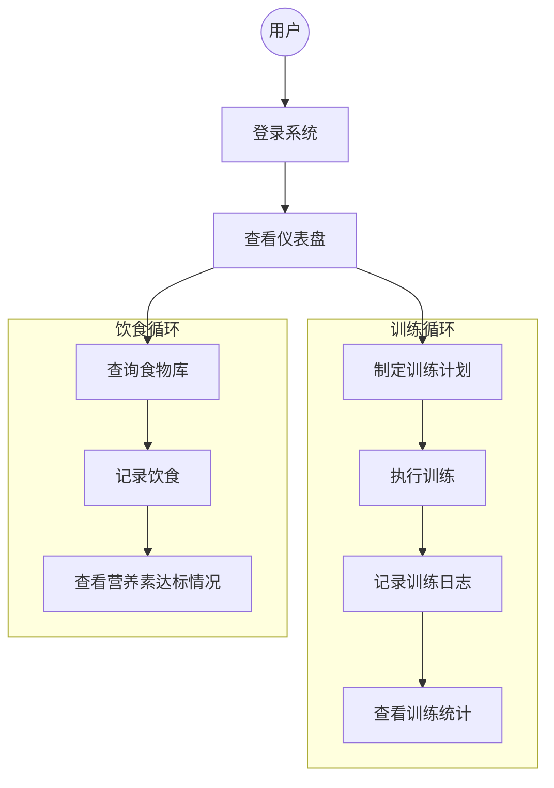
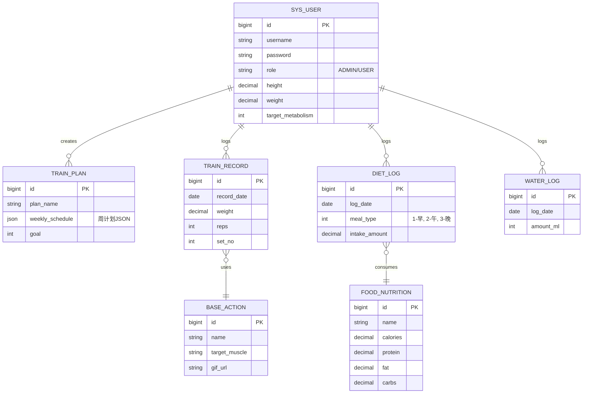
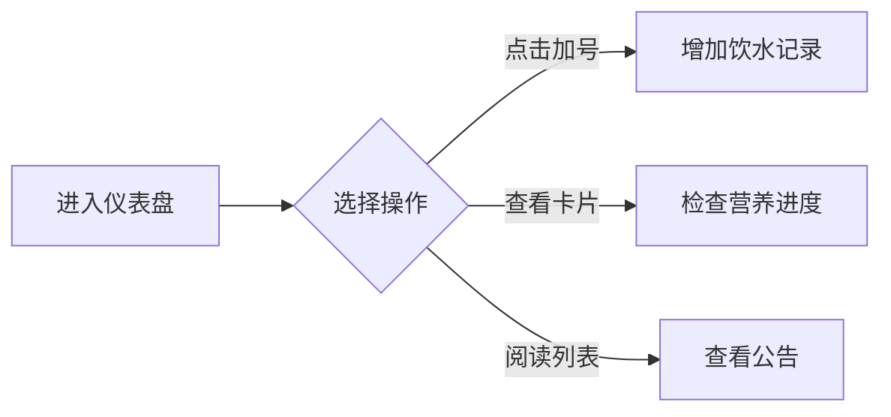

# IronLog 智能运动健康管理系统项目文档

**版本**: 1.0.0
**日期**: 2025-12-16
**作者**: 资深系统架构师 & 产品经理
**状态**: 正式发布

---

## 目录

1. [第一部分：需求规格说明书 (PRD)](#第一部分需求规格说明书-prd)
    - [1.1 项目背景与目标](#11-项目背景与目标)
    - [1.2 用户角色](#12-用户角色)
    - [1.3 核心业务流程](#13-核心业务流程)
    - [1.4 功能需求详解](#14-功能需求详解)
    - [1.5 非功能需求](#15-非功能需求)
2. [第二部分：系统设计文档 (SDD)](#第二部分系统设计文档-sdd)
    - [2.1 技术栈选型](#21-技术栈选型)
    - [2.2 系统架构设计](#22-系统架构设计)
    - [2.3 数据库设计 (ER图)](#23-数据库设计-er图)
    - [2.4 接口设计规范](#24-接口设计规范)
3. [第三部分：用户操作手册](#第三部分用户操作手册)
    - [3.1 系统登录与注册](#31-系统登录与注册)
    - [3.2 仪表盘 (Dashboard)](#32-仪表盘-dashboard)
    - [3.3 训练管理](#33-训练管理)
    - [3.4 营养膳食](#34-营养膳食)
    - [3.5 日历与统计](#35-日历与统计)
    - [3.6 个人设置](#36-个人设置)
    - [3.7 后台管理 (Admin)](#37-后台管理-admin)

---

## 第一部分：需求规格说明书 (PRD)

### 1.1 项目背景与目标

**IronLog** 是一款专为健身爱好者和专业运动员设计的全方位运动健康管理平台。旨在通过数字化的方式记录训练、饮食、身体指标及日程安排，帮助用户科学地管理健康，量化训练成果。

**核心目标**：
1.  **数据化训练**：提供动作库、训练计划及实时记录功能，替代传统纸质记录。
2.  **科学饮食**：内置食物营养库，精准计算每日摄入的热量及三大营养素。
3.  **可视化分析**：通过图表展示体重趋势、训练容量变化及饮食摄入情况。
4.  **高效管理**：为管理员提供用户管理及系统公告发布功能。

### 1.2 用户角色

| 角色 | 权限描述 |
| :--- | :--- |
| **普通用户 (User)** | 可以进行日常的训练记录、饮食记录、查看个人报表、管理个人计划及设置。 |
| **管理员 (Admin)** | 拥有系统最高权限，负责用户管理、系统公告发布、全局设置维护及基础数据（动作/食物）管理。 |

### 1.3 核心业务流程

#### 1.3.1 核心闭环流程图



### 1.4 功能需求详解

#### 1.4.1 用户端功能

1.  **仪表盘 (Dashboard)**
    *   展示今日待办训练计划。
    *   今日摄入热量概览（已摄入 vs 目标）。
    *   饮水记录快捷入口及进度环。
    *   最新系统公告展示。

2.  **训练管理 (Training)**
    *   **训练日记**：记录每日的训练动作、组数、重量、次数、RPE（自觉强度）。支持从动作库选择动作。
    *   **动作库**：查看系统预置的训练动作（含GIF演示、目标肌群）。
    *   **训练计划**：制定周计划（如“推拉腿”分化），设定每日目标肌群。

3.  **营养膳食 (Nutrition)**
    *   **饮食记录**：按早餐、午餐、晚餐、加餐记录食物摄入。
    *   **食物库**：搜索食物并查看营养成分（热量、蛋白质、碳水、脂肪）。
    *   **营养分析**：自动计算每日总摄入，并对比目标代谢。

4.  **日程与统计 (Schedule & Stats)**
    *   **我的日历**：月视图展示训练打卡情况（完成/未完成）。
    *   **数据统计**：展示体重变化曲线、训练容量趋势图。

5.  **个人设置 (Settings)**
    *   修改个人资料（身高、体重、生日、性别）。
    *   设定目标代谢值。
    *   修改密码。

#### 1.4.2 管理端功能

1.  **仪表盘**：系统概况统计（用户总数、今日活跃等）。
2.  **用户管理**：查看注册用户列表，禁用/启用违规账号。
3.  **系统设置**：发布系统公告，配置全局参数（如网站标题）。

### 1.5 非功能需求

*   **性能**：页面加载时间 < 1秒，API响应时间 < 200ms。
*   **兼容性**：支持主流浏览器（Chrome, Edge, Safari）。
*   **安全性**：密码加密存储（BCrypt），接口鉴权（Token/Session）。
*   **可用性**：界面简洁直观，操作符合人体工学。

---

## 第二部分：系统设计文档 (SDD)

### 2.1 技术栈选型

*   **前端**: Vue 3, Vite, Vue Router, Pinia (状态管理), Element Plus (UI组件库), ECharts (图表)。
*   **后端**: Java 21, Spring Boot 3, Spring Data JPA, Lombok。
*   **数据库**: MySQL 5.7/8.0。
*   **部署**: Docker, Nginx (反向代理)。

### 2.2 系统架构设计

系统采用经典的前后端分离架构，通过RESTful API进行通信。

```mermaid
graph TB
    subgraph Client [客户端层]
        Browser[浏览器 (Vue 3 SPA)]
    end

    subgraph Infrastructure [基础设施层]
        Nginx[Nginx 反向代理]
    end

    subgraph Backend [后端服务层]
        Controller[Web Controller]
        Service[Service 业务逻辑]
        Repository[JPA Repository]
    end

    subgraph Data [数据存储层]
        MySQL[(MySQL 数据库)]
    end

    Browser -- "HTTP/JSON" --> Nginx
    Nginx -- "Forward /api" --> Controller
    Controller --> Service
    Service --> Repository
    Repository -- "JDBC" --> MySQL
```

### 2.3 数据库设计 (ER图)

系统核心实体关系如下：



### 2.4 接口设计规范

*   **基础路径**: `/api`
*   **数据格式**: JSON
*   **通用响应结构**:
    ```json
    {
      "code": 200,
      "message": "Success",
      "data": { ... }
    }
    ```
*   **核心模块路径**:
    *   用户: `/api/users`
    *   训练: `/api/training`
    *   饮食: `/api/nutrition`
    *   动作: `/api/actions`

---

## 第三部分：用户操作手册

### 3.1 系统登录与注册

访问系统首页，您将看到登录界面。

*   **默认管理员账号**: `admin`
*   **默认管理员密码**: `admin123`
*   **测试用户账号**: `zhangsan` (如已初始化)

**操作步骤**:
1.  输入用户名和密码。
2.  点击“登录”按钮。
3.  如果登录成功，将跳转至仪表盘。

**(此处为登录界面截图占位符: login_screen.png - 展示包含用户名、密码输入框及蓝色登录按钮的界面)**

### 3.2 仪表盘 (Dashboard)

仪表盘是您的个人健康指挥中心。

**主要功能**:
1.  **概览卡片**: 顶部显示今日已摄入卡路里、蛋白质、碳水及脂肪的进度条。
2.  **饮水打卡**: 点击水杯图标或“+”号快速记录饮水（每次默认250ml或自定义）。
3.  **待办训练**: 显示今日计划需要训练的部位（基于您的训练计划）。
4.  **公告栏**: 查看管理员发布的最新消息。

**操作图示**:


### 3.3 训练管理

#### 3.3.1 记录训练 (WorkLog)
在“训练日记”页面，您可以记录每天的运动详情。

**操作步骤**:
1.  点击“添加动作”按钮。
2.  从弹出的动作库列表中选择动作（如：杠铃卧推）。
3.  输入组数、重量（kg）、次数（reps）及RPE。
4.  点击保存，系统自动计算训练容量。

**(此处为训练记录界面截图占位符: worklog_screen.png - 展示日期选择器、动作列表及输入表格)**

#### 3.3.2 制定计划
在设置或相关页面配置您的周计划。
*   选择周一至周日。
*   为每一天分配目标肌群（如：周一练胸，周二练背）。
*   系统将根据此计划在仪表盘提醒您。

### 3.4 营养膳食 (DietRecord)

记录每一餐，控制热量缺口。

**操作步骤**:
1.  进入“营养膳食”页面。
2.  选择日期和餐次（早餐/午餐/晚餐/加餐）。
3.  点击“添加食物”，搜索食物名称（如：鸡胸肉）。
4.  输入摄入量（克/个）。
5.  系统自动计算并累加至今日总摄入。

**(此处为饮食记录界面截图占位符: diet_screen.png - 展示食物搜索框及营养成分圆环图)**

### 3.5 日历与统计 (Calendar & Stats)

*   **我的日历**:
    *   绿色对勾 ✅：表示当天有训练记录。
    *   无标记：表示休息日。
    *   点击日期可跳转查看当天的详细记录。

*   **分析统计**:
    *   查看最近30天的体重变化折线图。
    *   查看各大肌群的训练频率饼图。

### 3.6 个人设置

在此页面完善您的身体数据，以便系统更精准地计算代谢。
*   **基础信息**: 昵称、身高、体重、性别。
*   **目标设置**: 设置您的每日目标摄入热量 (Target Metabolism)。

### 3.7 后台管理 (Admin Only)

仅 `admin` 账号可见。

1.  **用户管理**: 查看所有注册用户，可进行禁用操作。
2.  **系统设置**:
    *   **发布公告**: 输入标题和内容，设置优先级（普通/重要/紧急），点击发布后所有用户可见。
    *   **全局开关**: 开启/关闭注册功能。

---

*文档结束 - IronLog Team*
