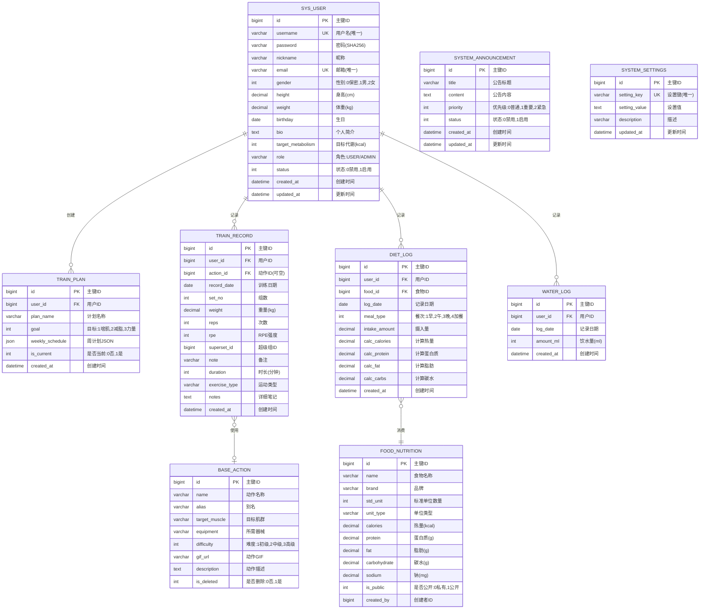

# IronLog 智能运动健康管理系统 - 完整项目文档

**版本**: 2.0.0
**日期**: 2025-12-16
**作者**: 资深系统架构师 & 产品经理
**状态**: 正式发布

---

## 📑 文档概览

本文档是 IronLog 智能运动健康管理系统的完整技术文档，包含需求分析、系统设计、用户指南、部署运维等全方位内容。适合产品经理、开发工程师、测试工程师、运维工程师及最终用户阅读。

---

## 📚 目录

1. [第一部分：需求规格说明书 (PRD)](#第一部分需求规格说明书-prd)
    - [1.1 项目背景与目标](#11-项目背景与目标)
    - [1.2 用户角色与权限](#12-用户角色与权限)
    - [1.3 核心业务流程](#13-核心业务流程)
    - [1.4 功能需求详解](#14-功能需求详解)
    - [1.5 非功能需求](#15-非功能需求)
    - [1.6 产品规划路线图](#16-产品规划路线图)
2. [第二部分：系统设计文档 (SDD)](#第二部分系统设计文档-sdd)
    - [2.1 技术栈选型](#21-技术栈选型)
    - [2.2 系统架构设计](#22-系统架构设计)
    - [2.3 数据库设计 (ER图)](#23-数据库设计-er图)
    - [2.4 接口设计规范](#24-接口设计规范)
    - [2.5 数据流与状态管理](#25-数据流与状态管理)
    - [2.6 安全架构设计](#26-安全架构设计)
3. [第三部分：用户操作手册](#第三部分用户操作手册)
    - [3.1 快速入门指南](#31-快速入门指南)
    - [3.2 系统登录与注册](#32-系统登录与注册)
    - [3.3 仪表盘 (Dashboard)](#33-仪表盘-dashboard)
    - [3.4 训练管理](#34-训练管理)
    - [3.5 营养膳食](#35-营养膳食)
    - [3.6 日历与统计](#36-日历与统计)
    - [3.7 个人设置](#37-个人设置)
    - [3.8 后台管理 (Admin)](#38-后台管理-admin)
    - [3.9 常见问题解答 (FAQ)](#39-常见问题解答-faq)
4. [第四部分：部署与运维文档](#第四部分部署与运维文档)
    - [4.1 环境准备](#41-环境准备)
    - [4.2 本地开发环境搭建](#42-本地开发环境搭建)
    - [4.3 Docker 容器化部署](#43-docker-容器化部署)
    - [4.4 生产环境部署](#44-生产环境部署)
    - [4.5 数据备份与恢复](#45-数据备份与恢复)
    - [4.6 监控与日志](#46-监控与日志)
    - [4.7 故障排查手册](#47-故障排查手册)

---

## 第一部分：需求规格说明书 (PRD)

### 1.1 项目背景与目标

**IronLog** 是一款专为健身爱好者和专业运动员设计的全方位运动健康管理平台。旨在通过数字化的方式记录训练、饮食、身体指标及日程安排，帮助用户科学地管理健康，量化训练成果。

**核心目标**：
1.  **数据化训练**：提供动作库、训练计划及实时记录功能，替代传统纸质记录。
2.  **科学饮食**：内置食物营养库，精准计算每日摄入的热量及三大营养素。
3.  **可视化分析**：通过图表展示体重趋势、训练容量变化及饮食摄入情况。
4.  **高效管理**：为管理员提供用户管理及系统公告发布功能。

### 1.2 用户角色与权限

系统采用基于角色的访问控制（RBAC）模型，定义了两类核心角色：

| 角色 | 权限范围 | 具体权限 |
| :--- | :--- | :--- |
| **普通用户 (USER)** | 个人数据管理 | ✅ 记录训练日志<br>✅ 记录饮食日志<br>✅ 记录饮水量<br>✅ 查看个人统计分析<br>✅ 创建和管理训练计划<br>✅ 修改个人资料<br>✅ 查看系统公告<br>❌ 访问后台管理 |
| **管理员 (ADMIN)** | 系统全局管理 | ✅ 所有普通用户权限<br>✅ 用户管理（查看、禁用）<br>✅ 发布系统公告<br>✅ 管理系统设置<br>✅ 管理基础动作库<br>✅ 管理食物营养库<br>✅ 查看系统统计数据 |

#### 权限验证流程


### 1.3 核心业务流程

#### 1.3.1 核心业务闭环流程


#### 1.3.2 用户旅程地图


### 1.4 功能需求详解

#### 1.4.1 用户端功能

1.  **仪表盘 (Dashboard)**
    *   展示今日待办训练计划。
    *   今日摄入热量概览（已摄入 vs 目标）。
    *   饮水记录快捷入口及进度环。
    *   最新系统公告展示。

2.  **训练管理 (Training)**
    *   **训练日记**：记录每日的训练动作、组数、重量、次数、RPE（自觉强度）。支持从动作库选择动作。
    *   **动作库**：查看系统预置的训练动作（含GIF演示、目标肌群）。
    *   **训练计划**：制定周计划（如“推拉腿”分化），设定每日目标肌群。

3.  **营养膳食 (Nutrition)**
    *   **饮食记录**：按早餐、午餐、晚餐、加餐记录食物摄入。
    *   **食物库**：搜索食物并查看营养成分（热量、蛋白质、碳水、脂肪）。
    *   **营养分析**：自动计算每日总摄入，并对比目标代谢。

4.  **日程与统计 (Schedule & Stats)**
    *   **我的日历**：月视图展示训练打卡情况（完成/未完成）。
    *   **数据统计**：展示体重变化曲线、训练容量趋势图。

5.  **个人设置 (Settings)**
    *   修改个人资料（身高、体重、生日、性别）。
    *   设定目标代谢值。
    *   修改密码。

#### 1.4.2 管理端功能

1.  **仪表盘**：系统概况统计（用户总数、今日活跃等）。
2.  **用户管理**：查看注册用户列表，禁用/启用违规账号。
3.  **系统设置**：发布系统公告，配置全局参数（如网站标题）。

### 1.5 非功能需求

#### 1.5.1 性能需求

| 指标 | 要求 | 备注 |
| :--- | :--- | :--- |
| 页面首屏加载时间 | < 1秒 | 基于3G网络环境 |
| API 响应时间 | < 200ms | P95 指标 |
| 并发用户数 | 支持 1000+ | 同时在线用户 |
| 数据库查询优化 | 添加索引，查询 < 100ms | 常用查询场景 |

#### 1.5.2 兼容性需求

*   **浏览器支持**：
    *   Chrome 90+
    *   Edge 90+
    *   Safari 14+
    *   Firefox 88+
*   **设备支持**：
    *   桌面端（1920x1080 及以上）
    *   平板端（768px 及以上）
    *   移动端响应式适配

#### 1.5.3 安全性需求

*   **认证安全**：
    *   密码使用 SHA-256 加密存储
    *   会话管理基于 localStorage
    *   防止 SQL 注入（使用 JPA 参数化查询）
*   **数据安全**：
    *   敏感数据传输使用 HTTPS
    *   用户数据隔离，严格权限控制
    *   定期数据备份
*   **访问控制**：
    *   CORS 跨域控制
    *   路由级别的权限验证
    *   后端 API 接口鉴权

#### 1.5.4 可用性需求

*   **界面设计**：
    *   遵循 Material Design 设计规范
    *   使用 Element Plus 组件库
    *   色彩对比度符合 WCAG 2.0 标准
*   **用户体验**：
    *   操作反馈及时（Loading、Toast 提示）
    *   错误提示清晰友好
    *   关键操作需二次确认

#### 1.5.5 可维护性需求

*   **代码规范**：
    *   前端使用 ESLint
    *   后端使用 Lombok 简化代码
*   **文档完整**：
    *   API 接口文档
    *   数据库设计文档
    *   部署运维文档

### 1.6 产品规划路线图


---

## 第二部分：系统设计文档 (SDD)

### 2.1 技术栈选型

#### 2.1.1 前端技术栈

| 技术 | 版本 | 用途说明 |
| :--- | :--- | :--- |
| **Vue 3** | 3.3.4 | 渐进式前端框架，提供响应式数据绑定和组件化开发 |
| **Vite** | 4.5.0 | 下一代前端构建工具，提供极速的开发体验 |
| **Vue Router** | 4.2.5 | 官方路由管理器，支持 SPA 路由 |
| **Element Plus** | 2.4.2 | 基于 Vue 3 的组件库，提供丰富的 UI 组件 |
| **ECharts** | 5.4.3 | 强大的数据可视化图表库 |
| **Axios** | 1.13.2 | HTTP 客户端，用于 API 请求 |

#### 2.1.2 后端技术栈

| 技术 | 版本 | 用途说明 |
| :--- | :--- | :--- |
| **Java** | 17 | 编程语言基础 |
| **Spring Boot** | 3.1.5 | 快速构建生产级应用的框架 |
| **Spring Data JPA** | 3.1.5 | 数据访问层抽象，简化数据库操作 |
| **Hibernate** | 6.2.x | JPA 实现，对象关系映射 |
| **Lombok** | Latest | 简化 Java 代码，自动生成 getter/setter |
| **MySQL Connector** | 8.0.33 | MySQL 数据库驱动 |

#### 2.1.3 数据库

*   **MySQL** 5.7/8.0 - 关系型数据库，存储用户、训练、饮食等核心数据

#### 2.1.4 开发与部署工具

*   **Maven** - Java 项目构建工具
*   **npm** - JavaScript 包管理器
*   **Git** - 版本控制
*   **Docker** - 容器化部署（可选）
*   **Nginx** - 反向代理和静态资源服务器（可选）

#### 2.1.5 技术选型理由


### 2.2 系统架构设计

系统采用经典的前后端分离架构，通过 RESTful API 进行通信，遵循分层架构设计原则。

#### 2.2.1 总体架构视图


#### 2.2.2 分层架构详解

```mermaid
graph LR
    subgraph 前端分层
        A1[视图组件<br/>Vue Components] --> A2[路由管理<br/>Vue Router]
        A2 --> A3[状态管理<br/>Store]
        A3 --> A4[API 调用<br/>Axios]
    end

    subgraph 后端分层
        B1[控制器层<br/>@RestController] --> B2[服务层<br/>@Service]
        B2 --> B3[数据访问层<br/>@Repository]
        B3 --> B4[实体层<br/>@Entity]
    end

    A4 -->|HTTP/JSON| B1
    B4 -->|ORM| DB[(Database)]

    style A1 fill:#bbdefb
    style B1 fill:#c5cae9
    style DB fill:#c8e6c9
```

#### 2.2.3 部署架构图


#### 2.2.4 核心模块架构


### 2.3 数据库设计 (ER图)

#### 2.3.1 完整实体关系图

系统核心实体关系如下，采用星型模型，以用户为中心扩展各业务实体：



#### 2.3.2 数据库索引设计

为提高查询性能，系统在关键字段上建立了索引：

| 表名 | 索引名 | 索引字段 | 索引类型 | 用途 |
| :--- | :--- | :--- | :--- | :--- |
| sys_user | idx_username | username | UNIQUE | 用户登录查询 |
| sys_user | idx_email | email | UNIQUE | 邮箱唯一性 |
| sys_user | idx_role | role | BTREE | 角色过滤 |
| train_record | idx_user_date | user_id, record_date | BTREE | 查询用户某日训练 |
| train_record | idx_action_id | action_id | BTREE | 查询动作使用记录 |
| diet_log | idx_user_date | user_id, log_date | BTREE | 查询用户某日饮食 |
| diet_log | idx_food_id | food_id | BTREE | 统计食物消费 |
| water_log | idx_user_date | user_id, log_date | BTREE | 查询用户某日饮水 |
| base_action | idx_target_muscle | target_muscle | BTREE | 按肌群查询动作 |
| food_nutrition | idx_name | name | BTREE | 食物名称搜索 |

#### 2.3.3 数据库表统计

| 分类 | 表名 | 记录估算 | 说明 |
| :--- | :--- | :--- | :--- |
| 用户相关 | sys_user | 1000+ | 注册用户 |
| 训练相关 | train_plan | 2000+ | 用户训练计划 |
| 训练相关 | train_record | 50000+ | 训练记录（高频） |
| 训练相关 | base_action | 100-500 | 基础动作库 |
| 营养相关 | food_nutrition | 1000-5000 | 食物营养库 |
| 营养相关 | diet_log | 100000+ | 饮食记录（高频） |
| 营养相关 | water_log | 30000+ | 饮水记录 |
| 系统相关 | system_announcement | 10-50 | 系统公告 |
| 系统相关 | system_settings | 10-20 | 系统设置 |

### 2.4 接口设计规范

#### 2.4.1 RESTful API 设计原则

*   **基础路径**: `/api`
*   **数据格式**: JSON (Content-Type: application/json)
*   **HTTP 方法语义**:
    *   GET - 查询资源
    *   POST - 创建资源
    *   PUT - 完整更新资源
    *   PATCH - 部分更新资源
    *   DELETE - 删除资源

#### 2.4.2 通用响应结构

**成功响应**:
```json
{
  "code": 200,
  "message": "操作成功",
  "data": {
    // 实际返回的业务数据
  }
}
```

**错误响应**:
```json
{
  "code": 400,
  "message": "参数错误：用户名不能为空",
  "data": null
}
```

**状态码说明**:

| 状态码 | 说明 | 使用场景 |
| :--- | :--- | :--- |
| 200 | 成功 | 操作成功 |
| 400 | 请求错误 | 参数校验失败 |
| 401 | 未授权 | 未登录或 Token 失效 |
| 403 | 禁止访问 | 无权限访问资源 |
| 404 | 未找到 | 资源不存在 |
| 500 | 服务器错误 | 系统内部错误 |

#### 2.4.3 完整 API 接口列表

##### **用户模块 (/api/users)**

| 方法 | 路径 | 说明 | 请求参数 | 响应示例 |
| :--- | :--- | :--- | :--- | :--- |
| POST | /register | 用户注册 | `{username, password, email}` | `{code:200, data:{id,username}}` |
| POST | /login | 用户登录 | `{username, password}` | `{code:200, data:{id,username,role}}` |
| GET | /{id} | 获取用户信息 | id (路径参数) | `{code:200, data:{user对象}}` |
| PUT | /{id} | 更新用户信息 | id + 用户对象 | `{code:200, message:"更新成功"}` |
| PUT | /{id}/password | 修改密码 | `{oldPassword, newPassword}` | `{code:200}` |

##### **训练模块 (/api/training)**

| 方法 | 路径 | 说明 | 请求参数 | 响应示例 |
| :--- | :--- | :--- | :--- | :--- |
| GET | /records | 获取训练记录 | `userId, date` | `{code:200, data:[record数组]}` |
| POST | /records | 添加训练记录 | 训练记录对象 | `{code:200, data:record}` |
| DELETE | /records/{id} | 删除训练记录 | id | `{code:200}` |
| GET | /actions | 搜索动作库 | `query` (动作名称) | `{code:200, data:[action数组]}` |
| POST | /actions | 添加动作 | 动作对象 | `{code:200, data:action}` |
| GET | /plans/{userId} | 获取训练计划 | userId | `{code:200, data:plan}` |
| POST | /plans | 创建训练计划 | 计划对象 | `{code:200}` |

##### **营养模块 (/api/nutrition)**

| 方法 | 路径 | 说明 | 请求参数 | 响应示例 |
| :--- | :--- | :--- | :--- | :--- |
| GET | /foods | 搜索食物库 | `query` (食物名称) | `{code:200, data:[food数组]}` |
| GET | /foods/{id} | 获取食物详情 | id | `{code:200, data:food}` |
| POST | /foods | 添加食物 | 食物对象 | `{code:200}` |
| GET | /diet-logs | 获取饮食记录 | `userId, date` | `{code:200, data:[log数组]}` |
| POST | /diet-logs | 添加饮食记录 | 饮食记录对象 | `{code:200}` |
| DELETE | /diet-logs/{id} | 删除饮食记录 | id | `{code:200}` |

##### **饮水模块 (/api/water)**

| 方法 | 路径 | 说明 | 请求参数 | 响应示例 |
| :--- | :--- | :--- | :--- | :--- |
| GET | /logs | 获取饮水记录 | `userId, date` | `{code:200, data:[log数组]}` |
| POST | /logs | 添加饮水记录 | `{userId, date, amountMl}` | `{code:200}` |
| GET | /today-total | 获取今日总量 | `userId, date` | `{code:200, data:totalMl}` |

##### **统计模块 (/api/stats)**

| 方法 | 路径 | 说明 | 请求参数 | 响应示例 |
| :--- | :--- | :--- | :--- | :--- |
| GET | /dashboard | 仪表盘数据 | `userId, date` | `{code:200, data:{nutrition,water,plan}}` |
| GET | /training-volume | 训练容量趋势 | `userId, days` | `{code:200, data:[{date,volume}]}` |
| GET | /body-weight | 体重趋势 | `userId, days` | `{code:200, data:[{date,weight}]}` |
| GET | /muscle-distribution | 肌群训练分布 | `userId, days` | `{code:200, data:{chest:10,back:8}}` |

##### **日历模块 (/api/calendar)**

| 方法 | 路径 | 说明 | 请求参数 | 响应示例 |
| :--- | :--- | :--- | :--- | :--- |
| GET | /month | 获取月视图 | `userId, year, month` | `{code:200, data:[{date,hasRecord}]}` |

##### **管理模块 (/api/admin)**

| 方法 | 路径 | 说明 | 请求参数 | 响应示例 |
| :--- | :--- | :--- | :--- | :--- |
| GET | /users | 获取用户列表 | `page, size` | `{code:200, data:{users,total}}` |
| PUT | /users/{id}/status | 修改用户状态 | `id, status` | `{code:200}` |
| GET | /announcements | 获取公告列表 | 无 | `{code:200, data:[公告数组]}` |
| POST | /announcements | 发布公告 | 公告对象 | `{code:200}` |
| GET | /settings | 获取系统设置 | 无 | `{code:200, data:{key:value}}` |
| PUT | /settings | 更新系统设置 | `{key,value}` | `{code:200}` |

#### 2.4.4 API 请求示例

**示例 1: 用户登录**

```bash
POST /api/users/login
Content-Type: application/json

{
  "username": "zhangsan",
  "password": "123456"
}
```

**响应**:
```json
{
  "code": 200,
  "message": "登录成功",
  "data": {
    "id": 2,
    "username": "zhangsan",
    "nickname": "张三",
    "role": "USER",
    "email": "zhangsan@example.com"
  }
}
```

**示例 2: 添加训练记录**

```bash
POST /api/training/records
Content-Type: application/json

{
  "userId": 2,
  "actionId": 1,
  "recordDate": "2025-12-16",
  "setNo": 3,
  "weight": 80.0,
  "reps": 8,
  "rpe": 8,
  "note": "感觉不错"
}
```

**响应**:
```json
{
  "code": 200,
  "message": "添加成功",
  "data": {
    "id": 20,
    "userId": 2,
    "actionId": 1,
    "recordDate": "2025-12-16",
    "setNo": 3,
    "weight": 80.0,
    "reps": 8,
    "rpe": 8,
    "note": "感觉不错"
  }
}
```

### 2.5 数据流与状态管理

#### 2.5.1 前端数据流


#### 2.5.2 训练记录数据流


### 2.6 安全架构设计

#### 2.6.1 认证与授权流程


#### 2.6.2 前端路由守卫


#### 2.6.3 安全防护措施

| 安全威胁 | 防护措施 | 实现方式 |
| :--- | :--- | :--- |
| SQL注入 | 参数化查询 | JPA 使用 @Query 参数绑定 |
| XSS攻击 | 输入过滤 | Element Plus 自动转义 |
| CSRF攻击 | Token验证 | 可考虑引入CSRF Token |
| 密码泄露 | 密码加密 | SHA-256单向加密存储 |
| 未授权访问 | 权限控制 | 路由守卫 + 后端鉴权 |
| 数据泄露 | 数据隔离 | 查询时强制userId过滤 |

---

## 第三部分：用户操作手册

### 3.1 系统登录与注册

访问系统首页，您将看到登录界面。

*   **默认管理员账号**: `admin`
*   **默认管理员密码**: `admin123`
*   **测试用户账号**: `zhangsan` (如已初始化)

**操作步骤**:
1.  输入用户名和密码。
2.  点击“登录”按钮。
3.  如果登录成功，将跳转至仪表盘。

**(此处为登录界面截图占位符: login_screen.png - 展示包含用户名、密码输入框及蓝色登录按钮的界面)**

### 3.3 仪表盘 (Dashboard)

仪表盘是您的个人健康指挥中心。

**主要功能**:
1.  **概览卡片**: 顶部显示今日已摄入卡路里、蛋白质、碳水及脂肪的进度条。
2.  **饮水打卡**: 点击水杯图标或“+”号快速记录饮水（每次默认250ml或自定义）。
3.  **待办训练**: 显示今日计划需要训练的部位（基于您的训练计划）。
4.  **公告栏**: 查看管理员发布的最新消息。

**操作图示**:


### 3.4 训练管理

#### 3.4.1 记录训练 (WorkLog)
在“训练日记”页面，您可以记录每天的运动详情。

**操作步骤**:
1.  点击“添加动作”按钮。
2.  从弹出的动作库列表中选择动作（如：杠铃卧推）。
3.  输入组数、重量（kg）、次数（reps）及RPE。
4.  点击保存，系统自动计算训练容量。

**(此处为训练记录界面截图占位符: worklog_screen.png - 展示日期选择器、动作列表及输入表格)**

#### 3.4.2 制定计划
在设置或相关页面配置您的周计划。
*   选择周一至周日。
*   为每一天分配目标肌群（如：周一练胸，周二练背）。
*   系统将根据此计划在仪表盘提醒您。

### 3.5 营养膳食 (DietRecord)

记录每一餐，控制热量缺口。

**操作步骤**:
1.  进入“营养膳食”页面。
2.  选择日期和餐次（早餐/午餐/晚餐/加餐）。
3.  点击“添加食物”，搜索食物名称（如：鸡胸肉）。
4.  输入摄入量（克/个）。
5.  系统自动计算并累加至今日总摄入。

**(此处为饮食记录界面截图占位符: diet_screen.png - 展示食物搜索框及营养成分圆环图)**

### 3.6 日历与统计 (Calendar & Stats)

*   **我的日历**:
    *   绿色对勾 ✅：表示当天有训练记录。
    *   无标记：表示休息日。
    *   点击日期可跳转查看当天的详细记录。

*   **分析统计**:
    *   查看最近30天的体重变化折线图。
    *   查看各大肌群的训练频率饼图。

### 3.7 个人设置

在此页面完善您的身体数据，以便系统更精准地计算代谢。
*   **基础信息**: 昵称、身高、体重、性别。
*   **目标设置**: 设置您的每日目标摄入热量 (Target Metabolism)。

### 3.8 后台管理 (Admin Only)

仅 `admin` 账号可见。

1.  **用户管理**: 查看所有注册用户，可进行禁用操作。
2.  **系统设置**:
    *   **发布公告**: 输入标题和内容，设置优先级（普通/重要/紧急），点击发布后所有用户可见。
    *   **全局开关**: 开启/关闭注册功能。

### 3.9 常见问题解答 (FAQ)

#### Q1: 忘记密码怎么办？

**答**: 目前系统暂不支持自助找回密码功能。请联系系统管理员重置密码，或使用管理员账号修改用户密码。

#### Q2: 如何删除已记录的训练/饮食数据？

**答**: 在对应的记录页面（训练日记/营养膳食），找到要删除的记录，点击删除图标即可。删除操作不可恢复，请谨慎操作。

#### Q3: 营养目标如何设置？

**答**: 
1. 进入"个人设置"页面
2. 找到"目标代谢"输入框
3. 输入您的每日目标摄入热量（单位：kcal）
4. 系统会根据此目标在仪表盘显示营养摄入进度

#### Q4: 训练计划如何修改？

**答**: 目前需要重新创建训练计划。进入训练计划页面，创建新计划并设置为当前计划即可。

#### Q5: 数据统计不准确怎么办？

**答**: 
- 确保您已正确记录训练和饮食数据
- 检查记录的日期是否正确
- 刷新页面重新加载数据
- 如问题持续存在，请联系管理员

#### Q6: 如何查看历史数据？

**答**: 
- **训练数据**: 在"训练日记"页面选择日期查看
- **饮食数据**: 在"营养膳食"页面选择日期查看
- **统计数据**: 在"分析统计"页面查看趋势图
- **日历视图**: 在"我的日历"页面查看月度训练打卡情况

#### Q7: 系统支持哪些浏览器？

**答**: 建议使用以下现代浏览器的最新版本：
- Google Chrome 90+
- Microsoft Edge 90+
- Safari 14+
- Firefox 88+

#### Q8: 可以在手机上使用吗？

**答**: 是的，系统采用响应式设计，支持在手机浏览器中访问。但为获得最佳体验，建议使用平板或电脑。

#### Q9: 如何联系管理员？

**答**: 系统公告中会提供管理员的联系方式，或通过注册时使用的邮箱联系。

#### Q10: 系统是否会保护我的隐私？

**答**: 
- 所有密码均加密存储
- 用户数据严格隔离，其他用户无法访问
- 不会向第三方分享您的个人数据
- 建议定期修改密码以确保账号安全

---

## 第四部分：部署与运维文档

### 4.1 环境准备

#### 4.1.1 硬件要求

**最低配置** (开发/测试环境):
- CPU: 2核心
- 内存: 4GB
- 磁盘: 20GB

**推荐配置** (生产环境):
- CPU: 4核心+
- 内存: 8GB+
- 磁盘: 50GB+ (SSD推荐)

#### 4.1.2 软件要求

| 软件 | 版本要求 | 用途 |
| :--- | :--- | :--- |
| Java JDK | 17+ | 运行后端应用 |
| Node.js | 16+ | 构建前端应用 |
| npm | 8+ | 前端包管理 |
| MySQL | 5.7 / 8.0 | 数据库 |
| Maven | 3.6+ | Java项目构建 |
| Git | 2.x | 代码管理 |

### 4.2 本地开发环境搭建

#### 4.2.1 克隆代码仓库

```bash
git clone https://github.com/your-repo/IronLog.git
cd IronLog
```

#### 4.2.2 数据库初始化

**步骤 1: 创建数据库**

```bash
mysql -u root -p
```

```sql
CREATE DATABASE ironlog CHARACTER SET utf8mb4 COLLATE utf8mb4_unicode_ci;
```

**步骤 2: 导入初始数据**

```bash
mysql -u root -p ironlog < init_database.sql
```

#### 4.2.3 配置后端

**步骤 1: 修改数据库配置**

编辑 `backend/src/main/resources/application.properties`:

```properties
spring.datasource.url=jdbc:mysql://localhost:3306/ironlog?useSSL=false&serverTimezone=UTC
spring.datasource.username=root
spring.datasource.password=your_password
```

**步骤 2: 构建并运行后端**

```bash
cd backend
mvn clean install
mvn spring-boot:run
```

后端服务将在 `http://localhost:8080` 启动。

#### 4.2.4 配置前端

**步骤 1: 安装依赖**

```bash
cd frontend
npm install
```

**步骤 2: 配置API地址**

如需修改后端API地址，可以在 `frontend/src` 中创建配置文件或直接修改API调用。

**步骤 3: 启动开发服务器**

```bash
npm run dev
```

前端应用将在 `http://localhost:5173` 启动。

#### 4.2.5 访问系统

打开浏览器访问 `http://localhost:5173`，使用测试账号登录。

### 4.3 Docker 容器化部署

#### 4.3.1 创建 Dockerfile (后端)

在 `backend` 目录创建 `Dockerfile`:

```dockerfile
FROM openjdk:17-jdk-slim
WORKDIR /app
COPY target/ironlog-backend-0.0.1-SNAPSHOT.jar app.jar
EXPOSE 8080
ENTRYPOINT ["java", "-jar", "app.jar"]
```

#### 4.3.2 创建 Dockerfile (前端)

在 `frontend` 目录创建 `Dockerfile`:

```dockerfile
FROM node:16-alpine AS build
WORKDIR /app
COPY package*.json ./
RUN npm install
COPY . .
RUN npm run build

FROM nginx:alpine
COPY --from=build /app/dist /usr/share/nginx/html
COPY nginx.conf /etc/nginx/conf.d/default.conf
EXPOSE 80
CMD ["nginx", "-g", "daemon off;"]
```

#### 4.3.3 创建 docker-compose.yml

在项目根目录创建 `docker-compose.yml`:

```yaml
version: '3.8'

services:
  mysql:
    image: mysql:8.0
    container_name: ironlog_mysql
    environment:
      MYSQL_ROOT_PASSWORD: 123456
      MYSQL_DATABASE: ironlog
    ports:
      - "3306:3306"
    volumes:
      - mysql_data:/var/lib/mysql
      - ./init_database.sql:/docker-entrypoint-initdb.d/init.sql
    networks:
      - ironlog_network

  backend:
    build: ./backend
    container_name: ironlog_backend
    depends_on:
      - mysql
    ports:
      - "8080:8080"
    environment:
      SPRING_DATASOURCE_URL: jdbc:mysql://mysql:3306/ironlog?useSSL=false&serverTimezone=UTC
      SPRING_DATASOURCE_USERNAME: root
      SPRING_DATASOURCE_PASSWORD: 123456
    networks:
      - ironlog_network

  frontend:
    build: ./frontend
    container_name: ironlog_frontend
    depends_on:
      - backend
    ports:
      - "80:80"
    networks:
      - ironlog_network

networks:
  ironlog_network:
    driver: bridge

volumes:
  mysql_data:
```

#### 4.3.4 启动容器

```bash
# 构建并启动所有服务
docker-compose up -d

# 查看运行状态
docker-compose ps

# 查看日志
docker-compose logs -f
```

### 4.4 生产环境部署

#### 4.4.1 部署架构


#### 4.4.2 生产环境配置清单

**安全配置**:
- ✅ 更改默认管理员密码
- ✅ 配置HTTPS证书
- ✅ 启用防火墙规则
- ✅ 配置数据库访问白名单
- ✅ 定期更新系统补丁

**性能优化**:
- ✅ 启用数据库连接池
- ✅ 配置缓存策略（如Redis）
- ✅ 启用前端资源压缩
- ✅ 配置CDN加速静态资源
- ✅ 数据库索引优化

**监控配置**:
- ✅ 配置应用日志收集
- ✅ 设置数据库性能监控
- ✅ 配置服务器资源监控
- ✅ 设置告警规则

### 4.5 数据备份与恢复

#### 4.5.1 数据库备份策略

**全量备份** (每日凌晨执行):

```bash
#!/bin/bash
DATE=$(date +%Y%m%d)
BACKUP_DIR="/backup/mysql"
mysqldump -u root -p123456 ironlog > $BACKUP_DIR/ironlog_full_$DATE.sql
gzip $BACKUP_DIR/ironlog_full_$DATE.sql
```

**增量备份**: 启用MySQL的binlog功能

**备份保留策略**:
- 最近7天的备份：每日全量
- 最近30天的备份：每周全量
- 超过30天：每月全量

#### 4.5.2 数据恢复

**恢复全量备份**:

```bash
gunzip ironlog_full_20251216.sql.gz
mysql -u root -p ironlog < ironlog_full_20251216.sql
```

### 4.6 监控与日志

#### 4.6.1 应用日志

**后端日志位置**: `backend/logs/`

**日志级别配置** (application.properties):

```properties
logging.level.root=INFO
logging.level.com.ironlog=DEBUG
logging.file.name=logs/ironlog.log
logging.file.max-size=10MB
logging.file.max-history=30
```

#### 4.6.2 关键指标监控

| 指标 | 正常范围 | 告警阈值 |
| :--- | :--- | :--- |
| CPU使用率 | < 70% | > 85% |
| 内存使用率 | < 80% | > 90% |
| 磁盘使用率 | < 80% | > 90% |
| API响应时间 | < 200ms | > 1000ms |
| 数据库连接数 | < 50 | > 80 |

### 4.7 故障排查手册

#### 4.7.1 常见问题诊断

**问题 1: 后端服务无法启动**

**症状**: Spring Boot启动失败

**排查步骤**:
1. 检查Java版本：`java -version`
2. 检查端口占用：`netstat -an | grep 8080`
3. 查看启动日志：`tail -f logs/ironlog.log`
4. 检查数据库连接：`mysql -u root -p -h localhost`

**问题 2: 前端页面空白**

**症状**: 浏览器打开页面空白

**排查步骤**:
1. 打开浏览器控制台查看错误
2. 检查API地址配置是否正确
3. 确认后端服务是否正常运行
4. 检查CORS跨域配置

**问题 3: 登录失败**

**症状**: 输入正确用户名密码仍无法登录

**排查步骤**:
1. 检查数据库中用户记录是否存在
2. 确认密码是否正确（可直接查询数据库hash值）
3. 查看后端日志是否有异常
4. 检查浏览器localStorage是否被禁用

**问题 4: 数据库连接失败**

**症状**: 应用报数据库连接错误

**排查步骤**:
1. 检查MySQL服务状态：`systemctl status mysql`
2. 验证数据库配置（host、port、用户名、密码）
3. 测试数据库连接：`mysql -h host -P port -u user -p`
4. 检查防火墙规则

#### 4.7.2 性能问题诊断

**慢查询分析**:

```sql
-- 开启慢查询日志
SET GLOBAL slow_query_log = 'ON';
SET GLOBAL long_query_time = 2;

-- 查看慢查询
SELECT * FROM mysql.slow_log ORDER BY query_time DESC LIMIT 10;
```

**内存泄漏排查**:

```bash
# 生成堆转储
jmap -dump:format=b,file=heap.bin <pid>

# 分析堆转储（使用 VisualVM 或 MAT）
```

---

## 附录

### A. 术语表

| 术语 | 英文 | 说明 |
| :--- | :--- | :--- |
| RPE | Rate of Perceived Exertion | 自觉强度评分，衡量训练强度的主观指标 |
| 1RM | One Rep Max | 单次最大重量 |
| 容量 | Volume | 训练容量 = 组数 × 重量 × 次数 |
| TDEE | Total Daily Energy Expenditure | 每日总能量消耗 |
| 三大营养素 | Macronutrients | 蛋白质、碳水化合物、脂肪 |

### B. 参考资料

- [Vue 3 官方文档](https://vuejs.org/)
- [Spring Boot 官方文档](https://spring.io/projects/spring-boot)
- [Element Plus 组件库](https://element-plus.org/)
- [MySQL 8.0 参考手册](https://dev.mysql.com/doc/refman/8.0/en/)

### C. 版本历史

| 版本 | 日期 | 变更说明 |
| :--- | :--- | :--- |
| 2.0.0 | 2025-12-16 | 完整文档重构，新增部署运维章节、API详细说明、Mermaid图表增强 |
| 1.0.0 | 2025-12-15 | 初始版本，包含基础PRD、SDD和用户手册 |

---

## 联系方式

**项目维护者**: IronLog Team
**项目地址**: https://github.com/MrWeilaity/IronLog
**技术支持**: 请通过 GitHub Issues 提交问题

---

**文档结束 - 感谢使用 IronLog 系统**

*让数据驱动你的健康之旅 💪*
