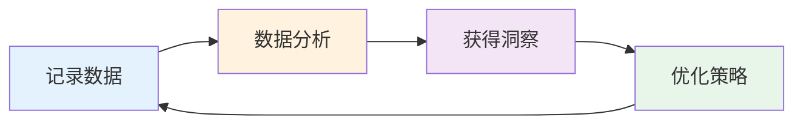
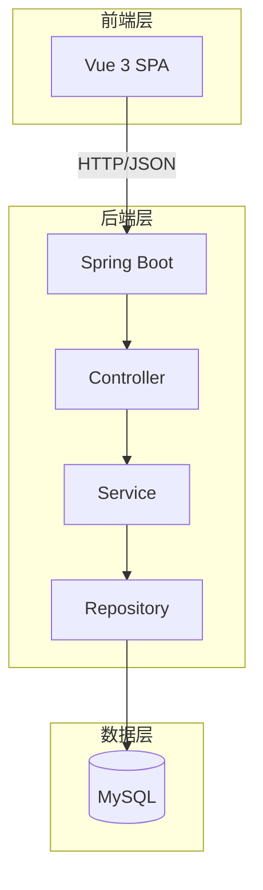

# IronLog - 智能运动健康管理系统

[](LICENSE)
[](https://www.oracle.com/java/)
[](https://spring.io/projects/spring-boot)
[](https://vuejs.org/)

## 📖 项目简介

IronLog 是一款专为健身爱好者和专业运动员设计的全方位运动健康管理平台。通过数字化的方式记录训练、饮食、身体指标及日程安排，帮助用户科学地管理健康，量化训练成果。

### ✨ 核心功能

- 🏋️ **训练管理** - 记录训练动作、组数、重量、次数和RPE，支持从动作库快速选择
- 🍎 **营养膳食** - 记录每日饮食，自动计算热量和三大营养素，对比目标代谢
- 📊 **数据分析** - 体重趋势、训练容量变化、肌群训练分布等可视化图表
- 📅 **日历打卡** - 月视图展示训练打卡情况，清晰了解训练规律
- 💧 **饮水记录** - 快捷记录每日饮水量，培养良好饮水习惯
- 📋 **训练计划** - 制定周训练计划，系统智能提醒今日训练目标
- 👥 **用户管理** - 管理员可管理用户、发布系统公告、配置全局设置

## 🚀 快速开始

### 前置要求

确保您的系统已安装以下软件：

- **Java** 17+
- **Node.js** 16+
- **MySQL** 5.7 或 8.0
- **Maven** 3.6+
- **npm** 8+

### 安装步骤

#### 1. 克隆项目

```bash
git clone https://github.com/MrWeilaity/IronLog.git
cd IronLog
```

#### 2. 初始化数据库

```bash
# 登录MySQL
mysql -u root -p

# 创建数据库
CREATE DATABASE ironlog CHARACTER SET utf8mb4 COLLATE utf8mb4_unicode_ci;

# 导入初始数据
mysql -u root -p ironlog < init_database.sql
```

#### 3. 配置后端

编辑 `backend/src/main/resources/application.properties`：

```properties
spring.datasource.url=jdbc:mysql://localhost:3306/ironlog?useSSL=false&serverTimezone=UTC
spring.datasource.username=root
spring.datasource.password=your_password
```

#### 4. 启动后端服务

```bash
cd backend
mvn clean install
mvn spring-boot:run
```

后端服务将在 `http://localhost:8080` 启动。

#### 5. 启动前端服务

```bash
cd frontend
npm install
npm run dev
```

前端应用将在 `http://localhost:5173` 启动。

#### 6. 访问系统

在浏览器中打开 `http://localhost:5173`

**默认测试账号**：
- 管理员：`admin` / `admin123`
- 普通用户：`zhangsan` / `123456`

## 🏗️ 项目结构

```
IronLog/
├── backend/                 # 后端 Spring Boot 项目
│   ├── src/
│   │   ├── main/
│   │   │   ├── java/
│   │   │   │   └── com/ironlog/
│   │   │   │       ├── controller/    # 控制器层
│   │   │   │       ├── service/       # 服务层
│   │   │   │       ├── repository/    # 数据访问层
│   │   │   │       ├── entity/        # 实体类
│   │   │   │       └── common/        # 通用工具类
│   │   │   └── resources/
│   │   │       └── application.properties
│   │   └── test/                      # 测试代码
│   └── pom.xml                        # Maven配置
├── frontend/                # 前端 Vue 3 项目
│   ├── src/
│   │   ├── views/           # 页面组件
│   │   ├── components/      # 可复用组件
│   │   ├── layout/          # 布局组件
│   │   ├── router/          # 路由配置
│   │   ├── utils/           # 工具函数
│   │   └── main.js          # 入口文件
│   ├── package.json         # npm配置
│   └── vite.config.js       # Vite配置
├── init_database.sql        # 数据库初始化脚本
├── PROJECT_DOCS.md          # 📘 完整项目文档
└── README.md               # 本文件
```

## 📚 文档

完整的项目文档请查看 **[PROJECT_DOCS.md](PROJECT_DOCS.md)**，包含：

- ✅ **需求规格说明书 (PRD)** - 项目背景、用户角色、功能需求、业务流程图
- ✅ **系统设计文档 (SDD)** - 技术栈、系统架构、数据库设计、API接口规范
- ✅ **用户操作手册** - 详细的功能使用说明和操作步骤
- ✅ **部署与运维文档** - 环境搭建、Docker部署、监控日志、故障排查

## 🛠️ 技术栈

### 后端

- **框架**: Spring Boot 3.1.5
- **数据库**: MySQL 8.0
- **ORM**: Spring Data JPA / Hibernate
- **构建工具**: Maven
- **Java版本**: 17

### 前端

- **框架**: Vue 3.3.4
- **构建工具**: Vite 4.5.0
- **路由**: Vue Router 4.2.5
- **UI组件**: Element Plus 2.4.2
- **图表**: ECharts 5.4.3
- **HTTP客户端**: Axios 1.13.2

## 🎯 核心特性

### 数据驱动的健康管理



### 智能统计分析

- 📈 体重变化趋势图
- 💪 训练容量趋势分析
- 🎯 营养素摄入对比
- 📅 训练频率热力图
- 🏆 肌群训练分布

## 🐳 Docker 部署

项目支持 Docker 容器化部署，简化部署流程。

### 使用 Docker Compose

创建 `docker-compose.yml` 文件（详见 PROJECT_DOCS.md），然后执行：

```bash
# 构建并启动
docker-compose up -d

# 查看运行状态
docker-compose ps

# 查看日志
docker-compose logs -f

# 停止服务
docker-compose down
```

## 🔐 安全说明

- ✅ 密码使用 SHA-256 加密存储
- ✅ 前端路由守卫进行权限验证
- ✅ 后端 API 接口鉴权
- ✅ 用户数据严格隔离
- ✅ SQL 注入防护（JPA 参数化查询）

**⚠️ 重要提示**：
- 请在生产环境中修改默认管理员密码
- 建议启用 HTTPS
- 定期备份数据库

## 📊 系统架构



## 🤝 贡献指南

欢迎贡献代码、提出问题和建议！

1. Fork 本仓库
2. 创建您的特性分支 (`git checkout -b feature/AmazingFeature`)
3. 提交您的更改 (`git commit -m 'Add some AmazingFeature'`)
4. 推送到分支 (`git push origin feature/AmazingFeature`)
5. 打开一个 Pull Request

## 📝 待办事项

- [ ] 添加移动端原生应用
- [ ] 集成可穿戴设备数据
- [ ] AI 智能训练建议
- [ ] 社交分享功能
- [ ] 多语言支持
- [ ] 数据导出功能

## 📄 许可证

本项目采用 MIT 许可证 - 详见 [LICENSE](LICENSE) 文件

## 👥 联系方式

- **项目地址**: https://github.com/MrWeilaity/IronLog
- **问题反馈**: [GitHub Issues](https://github.com/MrWeilaity/IronLog/issues)
- **作者**: MrWeilaity

## 🙏 鸣谢

感谢所有为本项目做出贡献的开发者和用户！

---

**让数据驱动你的健康之旅 💪**

*Made with ❤️ by IronLog Team*
